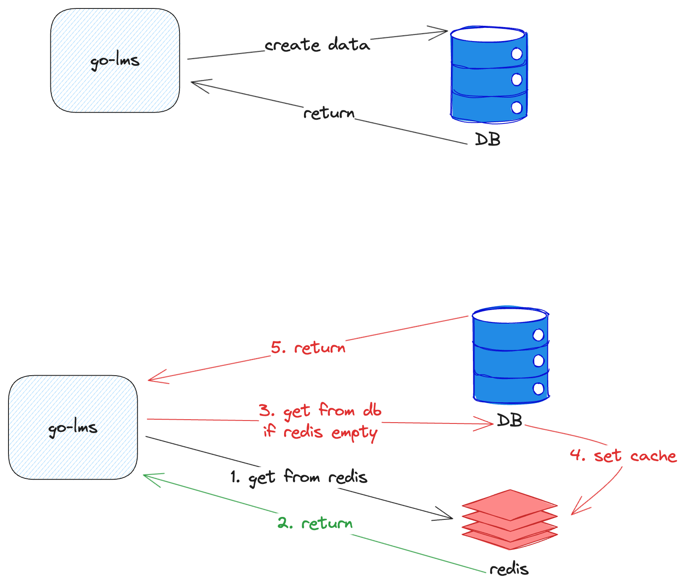

# Go Library Management


Go Library Management is a **Go** - based monolithic backend service that manage our Library database.

> It writen with **Golang**, so it has statically type

## Project Structure

```
├── Dockerfile
├── bin
├── cmd
│   └── main.go
├── config
│   └── config.go
├── config.yaml
├── db
│   └── migrations
├── deployments
├── docker-compose.yaml
├── go.mod
├── go.sum
├── internal
│   ├── controller
│   │   ├── author.go
│   │   ├── book.go
│   │   ├── request
│   │   │   ├── author.go
│   │   │   └── book.go
│   │   └── response
│   │       └── main.go
│   ├── dto
│   │   ├── author.go
│   │   └── book.go
│   ├── go_validator
│   │   └── main.go
│   ├── interfaces
│   │   ├── author.go
│   │   ├── book.go
│   │   ├── cache.go
│   │   ├── controller.go
│   │   ├── mock
│   │   │   ├── book_mock.go
│   │   │   ├── cache_mock.go
│   │   │   ├── controller_mock.go
│   │   │   ├── repository_mock.go
│   │   │   └── validator_mock.go
│   │   ├── repository.go
│   │   └── validator.go
│   ├── model
│   │   ├── author.go
│   │   └── book.go
│   ├── postgres
│   │   └── main.go
│   ├── redis
│   │   └── main.go
│   ├── repository
│   │   ├── author.go
│   │   ├── book.go
│   │   └── main.go
│   ├── usecase
│   │   ├── author_all_getter.go
│   │   ├── author_all_getter_test.go
│   │   ├── author_creator.go
│   │   ├── author_creator_test.go
│   │   ├── author_deleter.go
│   │   ├── author_deleter_test.go
│   │   ├── author_getter.go
│   │   ├── author_getter_test.go
│   │   ├── author_updater.go
│   │   ├── author_updater_test.go
│   │   ├── book_all_getter.go
│   │   ├── book_author_getter.go
│   │   ├── book_creator.go
│   │   ├── book_creator_test.go
│   │   ├── book_deleter.go
│   │   ├── book_getter.go
│   │   ├── book_updater.go
│   │   └── util_test.go
│   └── utils
│       └── error.go
├── readme.md
└── scripts
    └── entrypoint.sh
```

1. **Dockerfile**: `go-library-management` image
2. **db**: DB migrations. It will run with dbmate container
3. **docker-compose.yml**: `go-library-management` infrastructure and their dependecies
4. **internal**:
   1. **controller**: Use for handle request and response from client
   2. **dto**: Data Transfer Object. Useful for transfering data between controller layer to repository layer
   3. **go_validator**: validator library
   4. **interfaces**: collection of interace literally...
   5. **model**: represent of DB Table.
   6. **postgres**: PostgreSQL client.
   7. **repository**: handle communication between code and datastore
   8. **redis**: for cache.
   9. **usecase**: Our business process collected here...
5. **cmd**: root of the `go-library-management`. Entrypoint and bootstrap of service
6. **config**: config model

## How To Run

### Prerequisite

Please install:

1. Go 1.22
2. Docker
3. Git

### Steps

1. Run `go get` or `go mod tidy` on your local machine
2. Then, run `docker-compose up -d` for deploying service and its dependecies
3. Try to hit `http://localhost:8082` of any endpoints
4. For running unit test, run `go test ./...` since golang having built-in unit test.

## Why?

1. **Go Fiber**: fastest Go http framework currently. It runs above fasthttp.
2. **Gorm**: Because this projects having deadline 3 days. We need some ORM to be more fast when developing this services. And, If we need to change to raw, then it should be very easy when using gorm.
3. **PostgreSQL**
4. **Redis**: using for caching. Very common
5. **Docker**
6. Using **port-adapter pattern**, for example if our DB changed from PostgreSQL into MySQL it will not having any breaking changes
7. **REST API**: easy to maintain and performance not so very different with gRPC. And REST API easy to use with FE side
8. **dbmate**: Agnostic DB migrations, it have very lean learning curve since it just using SQL scripts

## Handling Million Requests

This is the current design. It is very basics



But, when it should to handle million data and request. First, we need check the code first. When the service having performance very bad. Then, need to check metrics like pprof to showing which part need to be improved. Then we could do **refactor**.

After that, if there an issue on:

1. create/update took very long: Need using async process like `RabbitMQ` or `Kafka`. Go Routines not recommended since it couldn't retryable whenether getting error.
2. get: there's two choices. If our code need to query to many tables, so use async get process using goroutines (with errgroup it would easier our job). Or, we're could using `Elasticsearch` since it specific using for search or query data.

Don't forget to do scaling (horizontal or vertical). And for our service, use Load Balancer would be helpful for managing load or request. And, lastly using kubernetes to manage our container or service.
